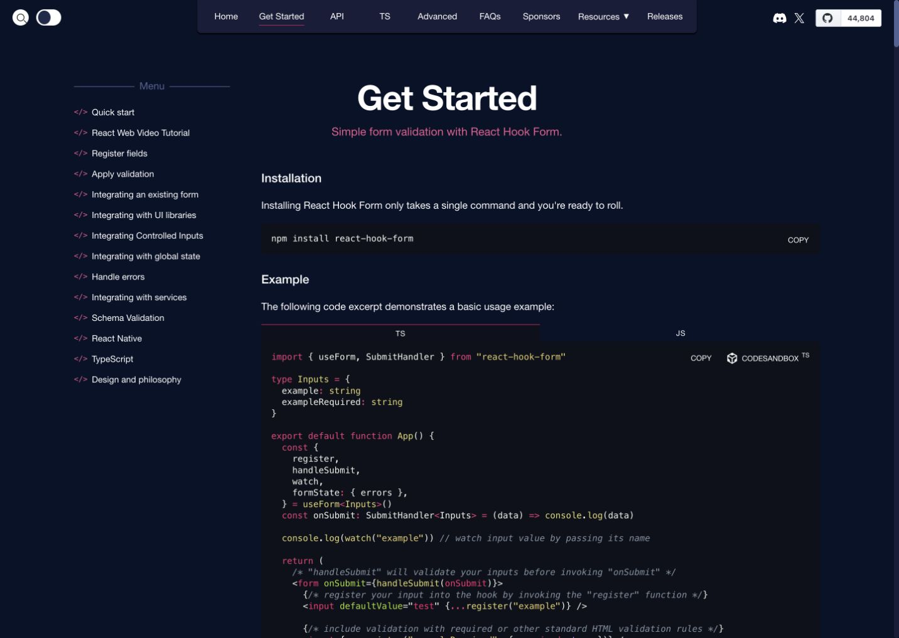
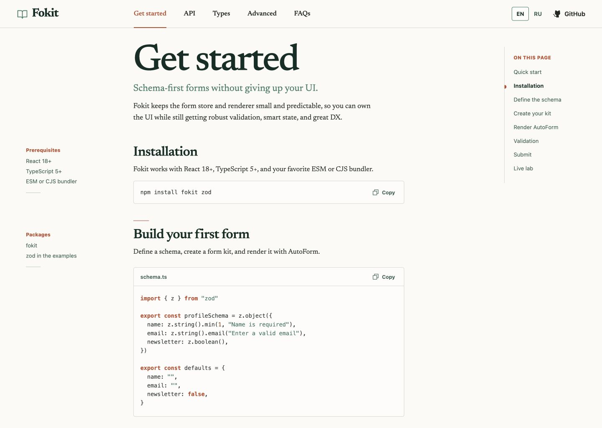
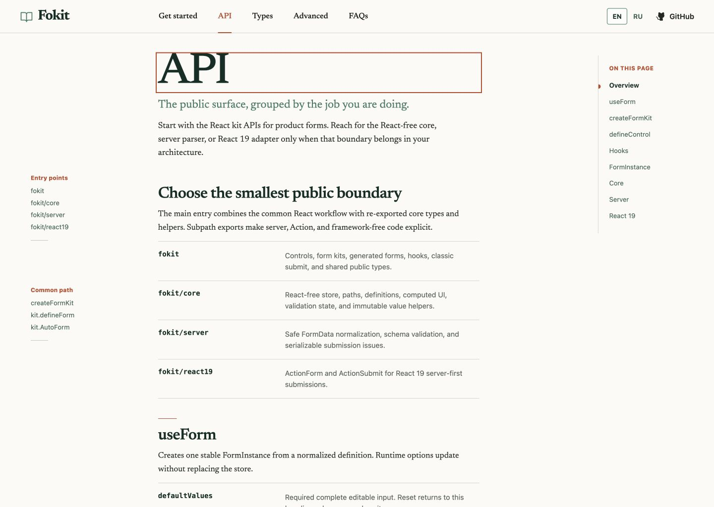
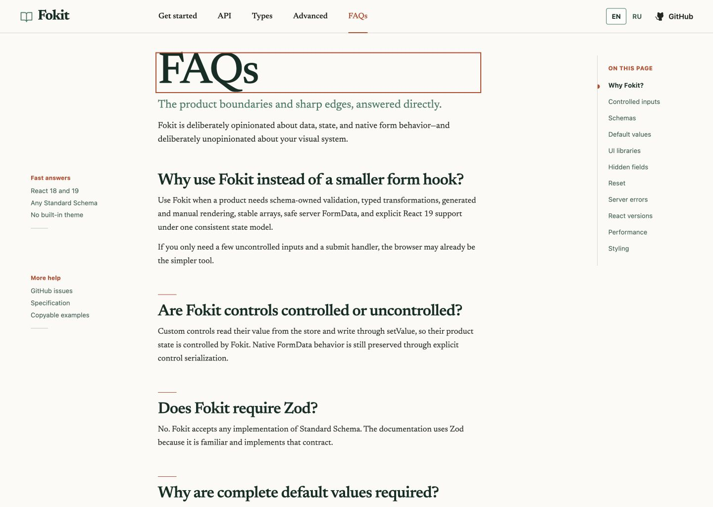
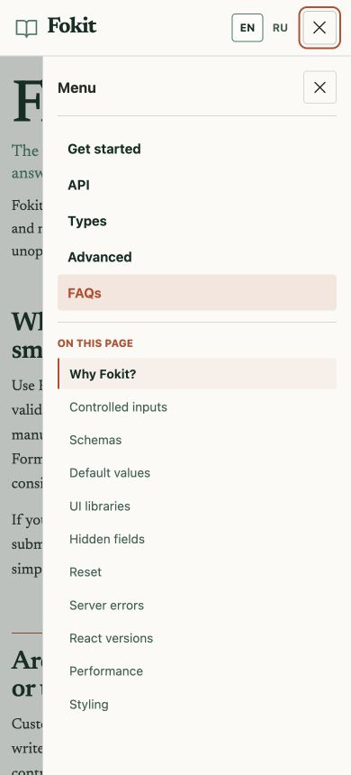
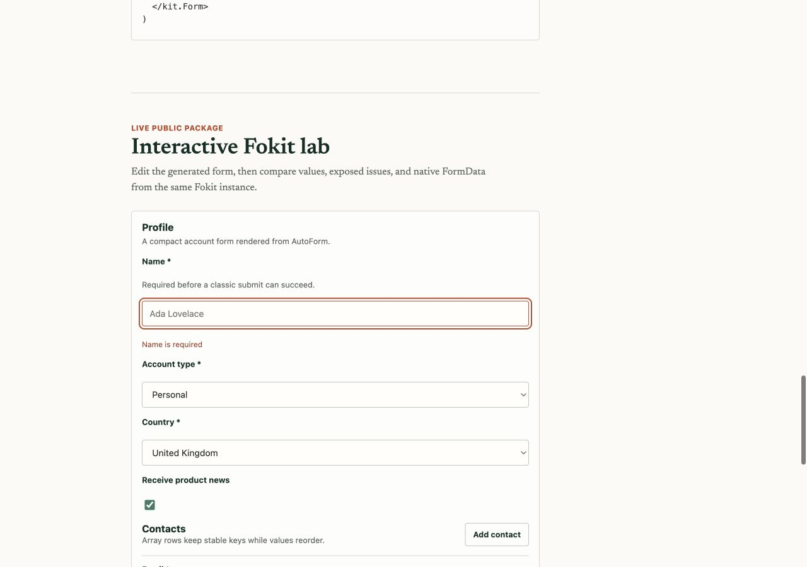
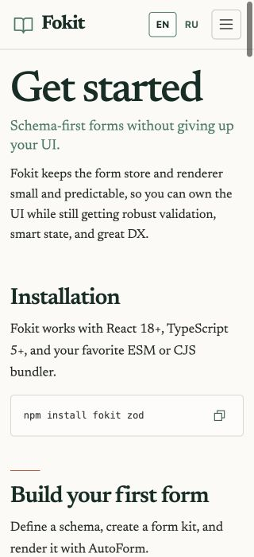
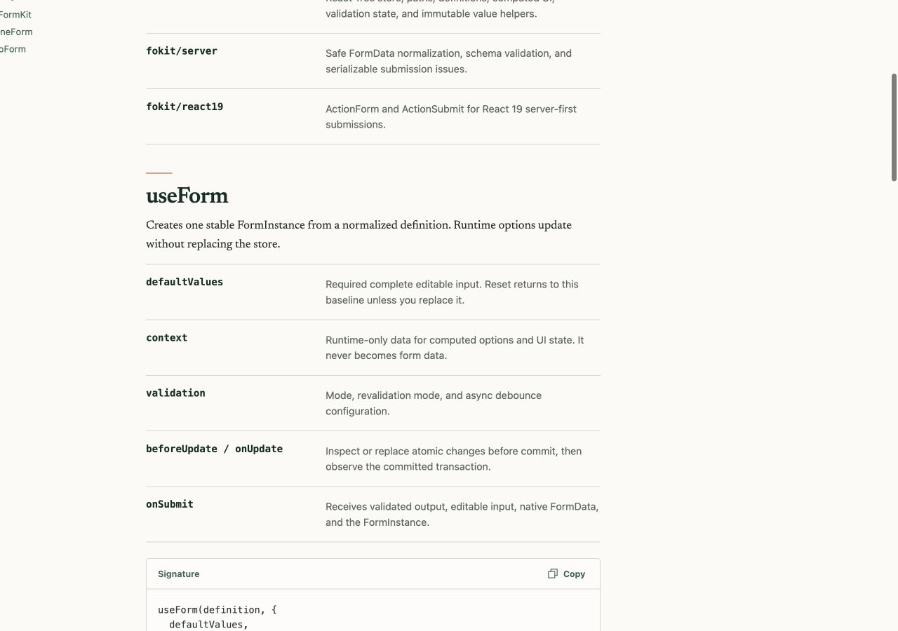

# Fokit documentation site audit

Date: 2026-07-29

## Scope

The audit compared the current Fokit documentation site with the React Hook
Form documentation reference and checked the main desktop, mobile, navigation,
API, FAQ, and validation-error paths.

No source code was changed as part of this audit.

## Verdict

The redesign has a strong visual foundation: the information hierarchy is
clear, typography is distinctive, the English and Russian content structures
match, and the core documentation pages remain readable down to 320 px.

Four issues should be fixed before calling the site release-ready:

1. Sticky navigation does not stick on long pages.
2. The mobile navigation is not implemented as an accessible modal drawer.
3. Route changes leave an oversized focus outline around the page heading.
4. API table-of-contents navigation cannot be bookmarked or shared.

## Evidence

### 0. React Hook Form reference

The reference exposes more product-level destinations than the current Fokit
site: Home, Sponsors, Resources, Releases, community links, theme selection,
repository status, and runnable CodeSandbox actions.

### 1. Get Started — healthy

The page has a clear entry point, recognizable brand, useful left navigation,
good content density, and a concrete interactive example.

### 2. API route transition — needs attention

After top-level navigation, focus is intentionally moved to the `h1`. That is
good for keyboard and screen-reader users, but the heading occupies the full
content width, so its focus outline becomes a large rust-colored rectangle.

Evidence:

- `docs-site/src/app.jsx:88-105` moves focus to `#page-title`.
- The active element was `h1#page-title`.
- Its computed outline was `rgb(187, 74, 43) solid 2px`.

Recommendation: preserve programmatic focus, but make the focus target wrap its
text or use a deliberate heading-focus treatment rather than removing the focus
indicator.

### 3. FAQ — needs attention

The page is easy to scan, but the same heading-focus problem appears after
navigation. “More help” items look like destinations but are plain text.

Evidence:

- `docs-site/src/content.js:773-790` and `:1624-1641` define the items as strings.
- `MetaRail` renders them as list items rather than links.

Recommendation: use actual destinations for GitHub Issues, the specification,
and examples, including equivalent Russian labels.

### 4. Mobile drawer — needs attention

The navigation fits the viewport, but it exposes duplicate close affordances and
does not behave as a modal dialog.

Evidence:

- Three controls have the accessible name “Close navigation”: the top-bar
  toggle, backdrop button, and drawer close button.
- `docs-site/src/app.jsx:162-179`, `:263-276`, and `:311-347` implement these
  separate controls.
- The drawer has no dialog semantics, focus trap, or inert background.

Recommendation: keep one visible close action, make the backdrop non-duplicative
to assistive technology, expose the drawer as a labelled modal dialog, trap
focus while open, close on Escape, and restore focus to the trigger.

### 5. Live validation error — needs attention

Validation is immediate and the message is placed next to the field. However,
the empty invalid field still displays “Ada Lovelace,” which reads like a value,
and the simultaneous focus/invalid borders add visual noise.

Evidence:

- `docs-site/src/lab.jsx:380` uses `Ada Lovelace` as the placeholder.
- The input/select boundary color `#bec9c2` has approximately 1.69:1 contrast
  against `#fffefa`, below the 3:1 non-text contrast target when the boundary is
  the only control affordance.

Recommendation: use instructional placeholder copy, simplify the combined
focus/error state, and darken the default control boundary to at least 3:1.
Verify error announcement with VoiceOver/NVDA; source inspection alone cannot
confirm it.

### 6. 320 px layout — healthy

The page remains legible and does not overflow horizontally at 320 px. The
measured document and viewport widths were both 320 px.

### 7. API section navigation — critical

Clicking a table-of-contents item scrolls to the right section, but the sticky
header and navigation rails disappear as the page scrolls. The URL also remains
`#/en/api`, so the selected API section cannot be copied, bookmarked, restored
on reload, or traversed with browser history.

Evidence:

- At `scrollY = 591`, `.topbar` had a bounding-box top of `-591` despite
  `position: sticky`.
- `docs-site/src/styles.css:33-45` applies `overflow-x: hidden` to `body` while
  the root document performs vertical scrolling. This makes `body` the sticky
  containing block without making it the vertical scroller.
- `docs-site/src/app.jsx:590-597` only calls `scrollIntoView`; it does not update
  route state or the URL.

Recommendation:

- Remove the sticky-containing-block conflict (for example, rely on the existing
  `html { overflow-x: clip; }` instead of `body { overflow-x: hidden; }`) and
  regression-test a long API page.
- Give API sections stable hash routes such as `#/en/api/use-form`, support
  direct loading, and keep Back/Forward behavior correct.

## Content and documentation gaps

### Public API coverage

The root package exports runtime symbols that are not mentioned in the docs
content:

- `cloneValue`
- `isAncestorPath`
- `isComputed`
- `isDescendantPath`
- `isDirtyEqual`
- `isSamePath`
- `mergePathValue`
- `parseArrayIndex`
- `pathsOverlap`
- `KitForm`

Either document these under a “Core utilities”/API section or stop presenting
them as public exports. Add a small export-to-docs coverage test so the mismatch
cannot silently return.

### Missing product-level surfaces

These were outside the original five requested content pages, but they are the
main remaining parity gap with React Hook Form:

- Home/overview page
- Resources/ecosystem page
- Releases/changelog destination
- Migration/versioning guidance
- Repository/community/status links
- Runnable sandbox links for key examples

Search is not urgent at the current content size. Add it when navigation or page
length makes browsing noticeably slower.

### Example verification

Full example files are imported from executable source, which is a strong
foundation. Inline snippets in `content.js` are not currently compiled or
typechecked. Add a docs-snippet verification step so examples cannot drift from
the package API.

## Release checks still needed

These were not fully proven by the visual audit:

1. Automated accessibility scan, keyboard-only pass, and VoiceOver/NVDA smoke
   test.
2. Firefox and Safari responsive smoke tests.
3. Lighthouse performance/accessibility run on the production build.
4. GitHub Pages deep-link, refresh, asset-path, and language-switching smoke
   tests.
5. Production metadata: favicon, canonical URL, Open Graph/Twitter metadata,
   `robots.txt`, and sitemap where compatible with the required hash-routing
   deployment.
6. Consider lazy-loading the interactive lab so API and FAQ visitors do not pay
   its full JavaScript cost.

## Recommended order

1. Fix sticky navigation and API deep links.
2. Correct the mobile drawer interaction and semantics.
3. Refine heading focus and live-lab field states.
4. Make support links real and close public API coverage gaps.
5. Run the release checks above.

## Automated verification

The following checks passed after the audit:

- `npm run check`
- `npm run knip`
- `npm run site:verify`
  - 8 documentation content/routing tests
  - production package and documentation builds
  - 8 Playwright documentation tests
