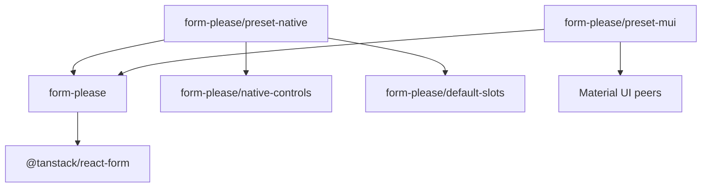

# Architecture

This document describes the current Form, Please runtime and public package
surface.

## System boundary

Form, Please is a React integration over TanStack Form.

| Owner | Responsibility |
| --- | --- |
| Standard Schema | Input validity, issues, and transformed submit output |
| TanStack Form | Editable values, field metadata, validation scheduling, subscriptions, submission state, and array operations |
| Form, Please | Typed UI definitions, definition resolution, generated fields, controls, slots, context, and accessibility wiring |
| Application | Product workflow, requests, caches, authorization, storage, server transport, and visual design |

There is no separate Form, Please form store, reducer, command pipeline,
middleware system, history layer, persistence layer, server protocol, or
validation cache.

## Package graph

Public JavaScript entries are limited to:

- `form-please`;
- `form-please/default-slots`;
- `form-please/native-controls`;
- `form-please/preset-native`;
- `form-please/preset-mui`.

`form-please/layout.css` and `form-please/package.json` are explicit non-code
exports. All JavaScript entries are React client modules. TanStack Form is a
required peer. Material UI and Emotion peers remain optional because only the
Material UI preset uses them.

## Canonical modules

| Module | Responsibility |
| --- | --- |
| `src/types.ts` | Schema, path, control, definition, resolver, slot, and structural types |
| `src/control-definition.ts` | Validate and freeze a typed control definition |
| `src/definition.ts` | Validate, normalize, and synchronously resolve UI definitions |
| `src/create-form-kit.tsx` | Create kits, bind TanStack Form, render generated UI, submit, normalize issues, and focus errors |
| `src/resource.ts` | Pure `ResourceState`, `matchResource`, and `fromResource` helpers |
| `src/index.ts` | Canonical root exports |

Default slots, native controls, and presets depend on these canonical modules.
They do not define another runtime.

## Form-kit ownership

`createFormKit` freezes one controls, slots, and grid snapshot. `defineForm`
normalizes a definition and records exact kit ownership. `useForm` accepts only
a definition from that kit.

`forContext<Context>()` is a type-only view. It returns the same runtime kit.
When `Context` is concrete, `useForm` requires a context value.

The kit does not support runtime extension. Build one complete controls and
slots registry before calling `createFormKit`.

## Definition model

A definition contains a Standard Schema and a recursive UI tree.

- A field selects a schema input path and a compatible registered control.
- A section groups nodes and supplies grid layout.
- An array selects an array path, defines one typed item default, and contains
  nodes relative to an item.
- A render node inserts a component that receives inherited `disabled` and
  `readOnly` state.

Sections and arrays can nest recursively. Array paths use TanStack bracket
syntax. `FieldPath` and `PathValue` use TanStack `DeepKeys` and `DeepValue`.

The type system aligns field paths with control values, control options,
control context, slot options, array item defaults, and grid values.

## Resolution

`kit.Fields` subscribes to the complete TanStack Form value. Each change
resolves the complete UI tree. Form, Please does not maintain a dependency
graph or resolution cache.

A resolver receives:

1. the complete deeply readonly schema input;
2. the deeply readonly runtime context.

Resolvers must return synchronously. Promise-like results cause an explicit
error. Readonly is a TypeScript contract; the runtime does not deep-clone or
proxy resolver input.

Visibility affects rendering only. Hidden fields preserve their TanStack Form
values.

## Form binding and lifetime

`kit.useForm` creates a thin `FormBinding`:

- `api`: the typed TanStack Form API;
- `definition`: the fixed normalized definition;
- `context`, `disabled`, and `readOnly`: Form, Please runtime inputs;
- internal generated-control and error-summary references for focus.

The definition is fixed for the hook lifetime. Passing another definition does
not replace it. A caller must change a React `key` to remount the component and
create another form.

Manual TanStack composition uses `form.api.Field`, `form.api.FormGroup`, and
`form.api.Subscribe` directly.

## Validation and submission

The definition Standard Schema is the only form-level validator. TanStack Form
uses submit validation before the first submit and change validation after it.

On a successful submit:

1. TanStack Form validates the editable input.
2. Form, Please validates the same input again.
3. The second result supplies transformed `FormOutput<Schema>`.
4. Form, Please calls `onSubmit({ value, input, form })`.

This double parse follows TanStack Form's Standard Schema transform guidance.
There is no custom validation cache. If the second parse returns issues after
the first parse succeeded, Form, Please rejects with an invariant error because
one input changed validity within one submit attempt.

Public issues contain only `message` and optional `path`.

## Generated rendering

`kit.Form` provides the binding context and owns native submit and reset event
handling. `kit.Fields` resolves and renders the definition. `kit.AutoForm`
composes the error summary and generated fields. `kit.Submit` delegates to the
configured submit slot.

Controls receive typed values and updates plus accessibility IDs, metadata,
options, context, and interaction flags. The control contract has no browser
serialization mode. Submission uses TanStack Form input values.

Slots own structural markup for fields, sections, arrays, array items, errors,
and submit buttons.

## Arrays

Generated array rows use current numeric indexes as React and path identity.
Add, remove, and move delegate to TanStack Form array field operations. Item
defaults are cloned before insertion.

Stable logical row IDs are outside the runtime contract. Applications that
need durable row identity must include it in the schema value.

## Error focus

Generated visible controls register their focusable element by current field
path. After invalid submit, Form, Please visits registered controls in rendered
order and focuses the first one with an issue that can receive focus. If none
can, it focuses the first rendered error-summary item. Issues for disabled
controls remain in that summary.

## Resource helpers

`ResourceState` is a pending, success, or error union. `matchResource` branches
on one state. `fromResource` creates a synchronous resolver and passes full
values plus context details to each branch.

These helpers do not fetch, cache, retry, cancel, or retain data.

## Versioning

This breaking replacement remains on the 1.x release line because the library
is still in development and does not provide backward compatibility. Release
automation owns the exact package version.
