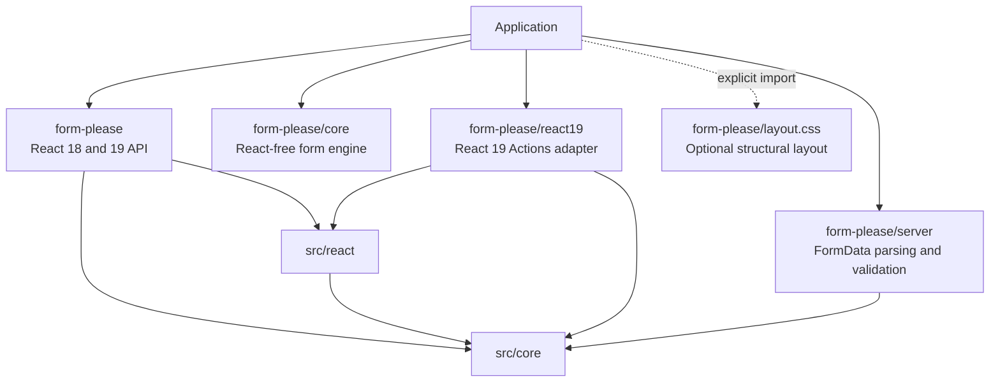

# Form, Please Architecture

- Status: Descriptive
- Audience: Maintainers and contributors
- Last updated: 2026-07-31

This document is a map of the current implementation. It explains where
responsibilities live, how data moves through the library, and which
boundaries changes must preserve.

The [specification](docs/SPEC.md) is the normative product contract. The
[architecture decision records](docs/adr/) explain why selected boundaries
exist. When this document disagrees with either the code or the specification,
investigate the difference instead of treating this document as a new source
of behavior.

## Architectural shape

Form, Please is one package with four JavaScript entry points and one optional CSS
entry point:



Dependencies point inward:

- `src/core` owns the form model and never imports React or DOM APIs.
- `src/react` adapts the core store to React 18-compatible components and
  hooks.
- `src/react19` adds Action-specific behavior and may depend on both core and
  React modules. Nothing in the main entry point depends on it.
- `src/server` reuses path, result, and Standard Schema logic from core but
  never imports React.
- `src/layout.css` is independent. No JavaScript entry point imports it.

The core can carry a render component or rich presentation value as an opaque
generic value. Only the React layer knows how to render it. This preserves the
React-free dependency boundary without maintaining a second UI tree.

## Execution environments

The main `form-please` and `form-please/react19` entries retain `"use client"` directives.
Importing either entry from a React Server Component establishes a client
boundary. `form-please/core` and `form-please/server` contain no client directive or React
runtime import and may be used independently in server-side code.

Client components can still participate in SSR. React subscriptions pass the
store's stable server snapshot to `useSyncExternalStore`, and hidden
serializer entries render in both server and client output.

Definitions that contain a render component or React element are not
serializable across a React Server Components boundary. Create or import those
definitions inside the client boundary. React-free definitions and core values
remain suitable for server-side use.

## Source map

| Area | Primary files | Responsibility |
| --- | --- | --- |
| Public exports | `src/index.ts`, `src/core/index.ts`, `src/react19/index.ts`, `src/server/index.ts` | Define the supported package surface |
| Definitions | `src/core/definition.ts`, `src/core/definition-fragment.ts`, `src/core/ui-types.ts`, `src/core/control-types.ts` | Type, scope, validate, normalize, and index reusable UI definitions |
| Paths and values | `src/core/path.ts`, `src/core/path-types.ts`, `src/core/value.ts` | Canonical deep paths and immutable value operations |
| Runtime store | `src/core/form-store.ts`, `src/core/form-state.ts`, `src/core/transaction.ts` | Transactions, snapshots, subscriptions, reset, focus, and runtime options |
| Derived state | `src/core/resolve-ui.ts`, `src/core/resource.ts`, `src/core/metadata.ts`, `src/core/issues.ts`, `src/core/array-state.ts` | Resolved UI, synchronous application-resource projection, dirty/touched state, issue exposure, and stable array rows |
| Validation | `src/core/validation.ts`, `src/core/standard-schema.ts` | Standard Schema execution and normalized results |
| Form kits | `src/react/create-form-kit.tsx`, `src/react/default-slots.tsx`, `src/react/native-controls.tsx` | Bind control and slot registries into a rendering integration |
| React runtime | `src/react/form-instance.ts`, `src/react/use-form.ts`, `src/react/hooks.ts`, `src/react/use-external-selector.ts` | Wrap and subscribe to the external store |
| Rendering | `src/react/fields.tsx`, `src/react/array-field.tsx`, `src/react/control.tsx`, `src/react/render-node.ts`, `src/react/slots.ts` | Turn resolved nodes into slots, controls, and explicit render components |
| Native forms | `src/react/form.tsx`, `src/react/hidden-inputs.tsx`, `src/react/submission.ts` | Accessibility, `FormData`, reset, and classic submission |
| React 19 Actions | `src/react19/action-form.tsx`, `src/react19/result-sync.ts`, `src/react19/action-submit.tsx` | Action submission state and server-result reconciliation |
| Server parsing | `src/server/normalize-form-data.ts`, `src/server/parse-form-data.ts`, `src/server/protocol.ts` | Bounded untrusted input normalization and validation |

## Definition lifecycle

A form has three independent inputs:

1. A Standard Schema defines valid data and transforms input into submission
   output.
2. A UI definition selects paths, structure, and derived presentation.
3. A form kit provides named controls and structural slots.

`createFormKit` freezes a control registry and a complete slot registry.
`kit.defineForm(schema)(definition)` passes the schema, UI tree, and registry
to `normalizeDefinition`.

The schema-bound define function also exposes `fragment(scope, nodes)` for a
definitely present object path. The React-free fragment transformer prefixes
object-relative field and array paths and wraps resolvers so their relative
reads track final absolute dependencies. Fragments are authoring-only: they are
erased before `normalizeDefinition`, so runtime code still sees exactly four
normalized node kinds. Their opaque brand models input, control, and context
requirements contravariantly, allowing compatible richer definitions without
admitting a weaker schema or runtime context.

Normalization is a one-time boundary. It canonicalizes paths and defaults,
checks node IDs and control references, freezes the tree, and builds flat
indexes such as `nodesById`, `fieldsByPath`, and `arraysByPath`. Runtime code
consumes this normalized definition; it does not repeatedly validate the
authoring shape.

Definitions contain control names, not control components. Structural
presentation is similarly mediated by slots. A `render` node is the explicit
React-only escape hatch for form-local content; core stores its component
opaquely and the React renderer mounts it.

## Runtime state and ownership

`createForm` creates a `FormInstance`, which owns one core `FormStore`.
`useForm` either creates that instance once or temporarily binds runtime
options to an existing instance. It does not create a second React state
model.

The store is the single source of runtime truth. Each immutable
`FormSnapshot` contains:

- input `values` and `isDirty`, derived from the store's private baseline;
- all issues plus the subset currently exposed for display;
- validation and submission status;
- runtime `context`;
- the resolved UI tree;
- field and array metadata.

The store holds `FormInput<Schema>`. Successful validation and submission
produce `FormOutput<Schema>`. Schema transforms never overwrite the input
state.

The baseline is fixed at instance creation until an explicit reset replaces
it. Loaded forms therefore mount after data is available, remount by product
identity, or call `reset(loadedValues)` deliberately; a new `defaultValues`
object identity is never an implicit reset signal.

Runtime context is read-only input to resolvers and controls. It is not copied
into values, validated, marked dirty, or serialized.

## Mutation pipeline

Every value-changing API reaches the same transaction boundary, including
control edits, imperative setters, array commands, resets, batches, and hidden
field value policies.

For a normal update the store:

1. normalizes commands into `set` and `unset` value changes;
2. applies them to a proposed value without mutating the current snapshot;
3. resolves the UI and repeatedly applies `valuePolicy` changes until the
   proposal converges;
4. calls the single `beforeUpdate` hook, which may accept, cancel, or replace
   the complete change set;
5. atomically commits values, array metadata, issue cleanup, and validation
   state;
6. derives a new snapshot and notifies only subscriptions whose selected value
   changed;
7. calls `afterUpdate` and schedules validation when the configured lifecycle
   requires it.

Array commands additionally preserve stable row keys and reindex touched paths
and issues before the atomic commit. A batch accumulates changes and commits
once; it is not an alternate update path.

Set, deep-set, unset, and `beforeUpdate` replacement changes use schema-typed
canonical paths without consulting UI registration. Array structure commands
still resolve a normalized array node because they require `itemDefault` and
row metadata. Generated field metadata and Action serialization likewise stay
tied to actual nodes and controls.

Hook events carry `ValueChange<Input>` so each set path remains correlated with
its value type. `extendValueChanges` is the small public composition helper for
preserving an incoming proposal while appending dependent changes.

Public values and snapshots are cloned or frozen at the store boundary.
Consumers must use commands instead of mutating returned objects.

## UI resolution and subscriptions

`resolveUi` converts the normalized definition into the concrete tree for the
current values and context. It:

- propagates parent visibility, disabled, and read-only state;
- expands relative nodes for each current array item;
- resolves labels, options, slot options, and other derived properties;
- produces lookup indexes for concrete field and array paths.

Render nodes participate in the same visibility and interaction resolution.
The React renderer unmounts invisible render nodes and passes effective
`disabled` and `readOnly` props to mounted components; core still treats the
component as opaque.

Resolver functions receive a revocable read-only values proxy. Every explicit
path read becomes a dependency. A previous result is reused while the resolver
identity, context reference, and dependency values are unchanged. Enumeration
and asynchronous resolvers are rejected because they would make dependencies
unbounded or timing-dependent.

`fromResource` remains inside this resolver boundary. It synchronously selects
an application-owned `ResourceState` and maps its active branch; path reads in
the selector and case mapper are observed by the same proxy. `matchResource`
serves application composition outside definition resolution. Neither helper
owns request state or changes definition topology.

React hooks bridge the store through `useSyncExternalStore`. `useFormState`
accepts a selector and equality function; `useField`, `useValue`, and
`useArrayField` build narrow selectors on top. Rendering code should subscribe
to the smallest slice it needs instead of reading the full snapshot into every
field.

## Rendering boundary

`kit.AutoForm` is convenience composition:

```text
useForm
  -> kit.Form
     -> ErrorSummary
     -> FieldsRenderer
        -> structural slot
           -> registered control
     -> caller children
```

The same parts are available for manual composition. `FormProvider` supplies
the form instance and DOM ID prefix; it does not own state.

The renderer maps resolved nodes as follows:

- `field` becomes the kit's `Field` slot and one registered control;
- `section` becomes the `Section` slot and recursively rendered children;
- `array` becomes `Array` and `ArrayItem` slots backed by core array commands;
- `render` mounts the opaque component with effective `disabled` and
  `readOnly` props.

Slots own semantic structure. Controls own only the interactive value editor
and must attach the supplied name, ID, ref, and ARIA relationships to the
appropriate DOM element. Form, Please supplies unstyled accessible default slots and
an explicit `nativeControls` registry; neither is a visual theme.

The stable `data-fp-*` and CSS-variable protocol connects structural slots
to the optional `layout.css`. Application controls, typography, color, and
component styling remain outside the library.

## Validation and issues

Standard Schema is the only validity authority. HTML attributes such as
`required` are semantic and presentation hints; generated forms use
`noValidate`.

Validation can run on change, blur, explicit calls, or submission. Async
non-submit validation is abortable and revision checked, so stale results
cannot replace issues for newer values. Debouncing belongs to this lifecycle,
not to controls.

Explicit path validation always runs the complete schema. `validate(path)` and
`validatePaths(paths)` limit the issues returned and newly exposed by that call
to overlapping paths; already exposed issues stay visible. Object-level and
path-owned cross-field refinements therefore remain authoritative even for a
wizard stage. Pathless form-level issues stay in raw errors but match no
non-empty subset; stage-specific refinements must report an owning path.
`focusFirstError(paths?)` then searches displayed editable fields before the
mounted summary and reports whether focus moved.

Issues have three sources:

- `schema` from Standard Schema validation;
- `manual` from imperative application calls;
- `server` from Action results.

Stored errors and displayed errors are separate. Blur, submit, and explicit
validation expose issues according to the validation lifecycle. Issues without
a visible owning field appear in the summary.

## FormData and submission

The control registry is the shared client/server serialization seam. Every
control declares one `formData` mode:

- `native`: the rendered control submits successful native inputs;
- `hidden`: a pure serializer produces hidden inputs;
- `none`: the value is unavailable to `ActionForm`.

Hidden inputs also carry reserved array markers so empty and single-item arrays
retain their shape. Compatibility checks reject a submission that would
silently lose a preserved value.

### Classic React submission

`kit.Form` owns the native form's submit and reset handlers. Submission
captures browser `FormData`, starts a store submission attempt, validates the
current input, and calls `onSubmit` only with a successful schema output.
Invalid submissions expose and focus the first eligible issue.

### React 19 Actions

`ActionForm` is isolated in `form-please/react19`. It verifies React 19 Action
support, checks that every present field value can be represented in
`FormData`, and tracks edits made while an Action is pending.

A returned `FormResult` is reconciled through the core store. Server issues
that overlap newer client edits are discarded. A stale schema result schedules
validation of the current values instead of installing obsolete errors.

### Server parsing

`parseFormData` first normalizes untrusted names into a null-prototype object.
The normalizer uses a bounded trie, rejects unsafe or mixed object/array
shapes, requires contiguous indexes, and recognizes only the reserved array
marker protocol. Limits for entry count, path length, depth, and array index
are resolved before traversal.

These limits bound structural parsing; they do not limit the HTTP request,
multipart body, file count, or file size. Applications must enforce those
transport limits before calling `parseFormData`. Primitive-looking values
remain strings and file values remain `File` objects until Standard Schema
validation; parsing and coercion belong to the schema.

The normalized input is then passed to the same Standard Schema contract.
Parsing failures and schema failures become serializable `SubmissionIssue`
values that the Action client can reconcile.

## Extension boundaries

`kit.extend` creates a new immutable snapshot:

- control names are add-only; replacing an inherited control is rejected;
- slots may replace inherited slots if their option contracts remain
  compatible;
- definitions retain the complete registry and presentation requirements of
  the kit that created them.

This makes a base definition usable by a compatible extended kit without
allowing an extension to silently reinterpret an existing field.

New behavior should normally fit one of the existing boundaries: a control, a
slot, a derived UI property, or an application-level concern. Form, Please does not
provide a middleware chain, schema inference, remote UI language, visual form
builder, theme, wizard engine, or application persistence layer.

## Build and verification

`tsdown.config.ts` builds the four explicit entries as ESM and CommonJS with
declarations and source maps. Dependencies are never bundled, entry signatures
are preserved, and `layout.css` is copied separately. `package.json` exposes
only the supported subpaths, so internal deep imports are closed.

Verification is layered:

- co-located Vitest suites cover core, React, React 19, and server behavior;
- `tests/types` encodes compile-time contracts;
- `tests/browser` covers DOM layout and documentation behavior in a browser;
- `tests/package` checks metadata and built artifacts;
- `tests/fixtures` smoke-tests ESM, CommonJS, React 18, React 19, Vite, and
  Next.js consumers;
- the documentation site has its own type, content, build, and browser checks.

Before reporting a change complete, run the checks required by `AGENTS.md`.
For changes to public exports or package boundaries, use the broader package
and smoke verification described in `package.json`.

## Rules for architectural changes

When a change crosses a boundary:

1. update the normative specification if public behavior changes;
2. add or supersede an ADR when the dependency or ownership decision changes;
3. update this map when responsibility moves between modules;
4. test the boundary at its narrowest layer and at the affected public entry
   point.

Do not bypass an existing boundary for local convenience. In particular, keep
React out of core and server, React 19 out of the main entry point, CSS imports
explicit, schema output separate from store input, and all value changes inside
the transaction pipeline.
