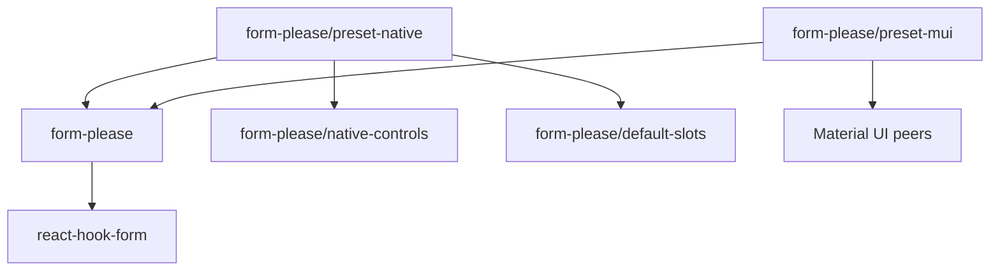

# Architecture

This document describes the current Form, Please runtime and public package
surface.

## System boundary

Form, Please is a React integration over React Hook Form.

| Owner | Responsibility |
| --- | --- |
| Standard Schema | Input validity, issues, and transformed submit output |
| React Hook Form | Editable values, field metadata, validation scheduling, subscriptions, submission state, context, and array operations |
| Form, Please | Typed UI definitions, definition resolution, generated fields, controls, slots, context, and accessibility wiring |
| Application | Product workflow, requests, caches, authorization, storage, server transport, and visual design |

There is no separate Form, Please form store, reducer, command pipeline,
middleware system, history layer, persistence layer, server protocol, or
validation cache.

## Package graph

Public JavaScript entries are limited to:

- `form-please`;
- `form-please/default-slots`;
- `form-please/native-controls`;
- `form-please/preset-native`;
- `form-please/preset-mui`.

`form-please/layout.css` and `form-please/package.json` are explicit non-code
exports. All JavaScript entries are React client modules. React Hook Form 7.55
or newer within major version 7 is a required peer. Material UI and Emotion
peers remain optional because only the
Material UI preset uses them.

## Canonical modules

| Module | Responsibility |
| --- | --- |
| `src/types.ts` | Schema, path, control, definition, resolver, slot, and structural types |
| `src/control-definition.ts` | Validate and freeze a typed control definition |
| `src/definition.ts` | Validate, normalize, and synchronously resolve UI definitions |
| `src/standard-schema-resolver.ts` | Validate through Standard Schema once and translate all issues to and from RHF errors |
| `src/create-form-kit.tsx` | Create kits, bind React Hook Form, render generated UI, submit, and focus errors |
| `src/resource.ts` | Pure `ResourceState`, `matchResource`, and `fromResource` helpers |
| `src/index.ts` | Canonical root exports |

Default slots, native controls, and presets depend on these canonical modules.
They do not define another runtime.

## Form-kit ownership

`createFormKit` freezes one controls, slots, and grid snapshot. `defineForm`
normalizes a definition and records exact kit ownership. `useForm` accepts only
a definition from that kit.

`forContext<Context>()` is a type-only view. It returns the same runtime kit.
When `Context` is concrete, `useForm` requires a context value.

The kit does not support runtime extension. Build one complete controls and
slots registry before calling `createFormKit`.

## Definition model

A definition contains a Standard Schema and a recursive UI tree.

- A field selects a schema input path and a compatible registered control.
- A section groups nodes and supplies grid layout.
- An array selects an array path, defines one typed item default, and contains
  nodes relative to an item.
- A render node inserts a component that receives inherited `disabled` and
  `readOnly` state.

Sections and arrays can nest recursively. Paths use RHF dot notation, including
numeric array segments such as `speakers.0.name`. `FieldPath`, `PathValue`, and
`ArrayFieldPath` delegate to RHF path types. Generated arrays contain object
items; primitive arrays can use an application-owned control.

The type system aligns field paths with control values, control options,
control context, slot options, array item defaults, and grid values.

## Resolution

`kit.Fields` watches the complete React Hook Form value. Each change
resolves the complete UI tree. Form, Please does not maintain a dependency
graph or resolution cache.

A resolver receives:

1. the complete deeply readonly schema input;
2. the deeply readonly runtime context.

Resolvers must return synchronously. Promise-like results cause an explicit
error. Readonly is a TypeScript contract; the runtime does not deep-clone or
proxy resolver input.

Visibility affects rendering only. Hidden fields preserve their React Hook
Form values because unregistration is disabled.

## Form binding and lifetime

`kit.useForm` creates a thin `FormBinding`:

- `api`: the unchanged typed RHF `UseFormReturn`;
- `definition`: the fixed normalized definition;
- `context`: the Form, Please runtime context.

The binding belongs to the exact kit that created it. Another kit's `Form`
rejects it before rendering.

Disabled and read-only state, generated-control references, the submit wrapper,
and the error-summary reference remain private runtime data.

The definition is fixed for the hook lifetime. Passing another definition does
not replace it. A caller must change a React `key` to remount the component and
create another form.

`kit.Form` provides the same API through RHF `FormProvider`. Manual composition
uses ordinary RHF APIs such as `register`, `Controller`, `useController`,
`useWatch`, `useFormState`, `useFieldArray`, and `useFormContext`.

## Validation and submission

The definition Standard Schema is the only form-level validator. The internal
RHF resolver collects all issues, including issues without a path. Validation
defaults to submit mode and change revalidation after the first submit.

On a successful submit:

1. `kit.Form` captures a deep editable-input snapshot while preserving browser
   values such as `File` and `Blob`.
2. RHF invokes the internal Standard Schema resolver once.
3. The resolver returns transformed `FormOutput<Schema>`.
4. Form, Please calls `onSubmit({ value, input, form })` with the matching
   snapshot and output.

Direct `form.api.handleSubmit(onValid, onInvalid)` remains raw RHF behavior and
does not invoke the configured Form Please wrapper. Resolver ownership,
`criteriaMode: "all"`, retained hidden values, and RHF error focus are runtime
invariants. Callers can choose `mode`, `reValidateMode`, and `delayError` but
cannot replace the resolver.

Public issues contain only `message` and optional `path`.

## Generated rendering

`kit.Form` provides RHF and Form Please contexts and owns native submit and
reset event handling. `kit.Fields` resolves and renders the definition.
`kit.AutoForm` composes the error summary and generated fields. `kit.Submit`
delegates to the configured submit slot.

Controls receive typed values and updates plus accessibility IDs, metadata,
options, context, and interaction flags. The control contract has no browser
serialization mode. Submission uses React Hook Form values.

Slots own structural markup for fields, sections, arrays, array items, errors,
and submit buttons.

## Arrays

Generated arrays use RHF `useFieldArray`. Paths contain current numeric indexes,
while each React row key uses RHF's stable `field.id`. Add, remove, and move
delegate to `append`, `remove`, and `move`. Item defaults are cloned before
insertion. Applications still need a schema-owned ID when row identity must
survive serialization or a new form instance.

## Error focus

RHF focuses the first registered invalid field, including application-owned
fields, and therefore owns focus order. After RHF's focus attempts, Form Please
focuses the first error-summary item only when focus did not land on an invalid
field. Issues without a path and issues for disabled generated controls remain
in that summary. Because RHF reserves the top-level `errors.root` key, schema
issues for input paths under `root` are mirrored internally and use the summary
fallback without losing their original path.

## Resource helpers

`ResourceState` is a pending, success, or error union. `matchResource` branches
on one state. `fromResource` creates a synchronous resolver and passes full
values plus context details to each branch.

These helpers do not fetch, cache, retry, cancel, or retain data.

## Versioning

This breaking replacement remains on the 1.x release line because the library
is still in development and does not provide backward compatibility. Release
automation owns the exact package version.
